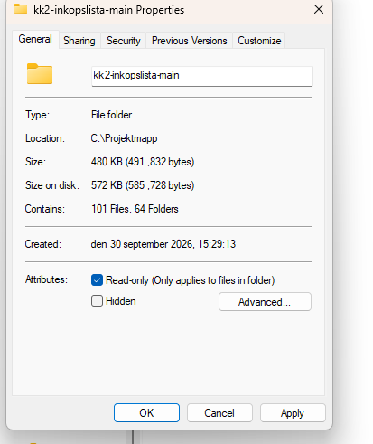
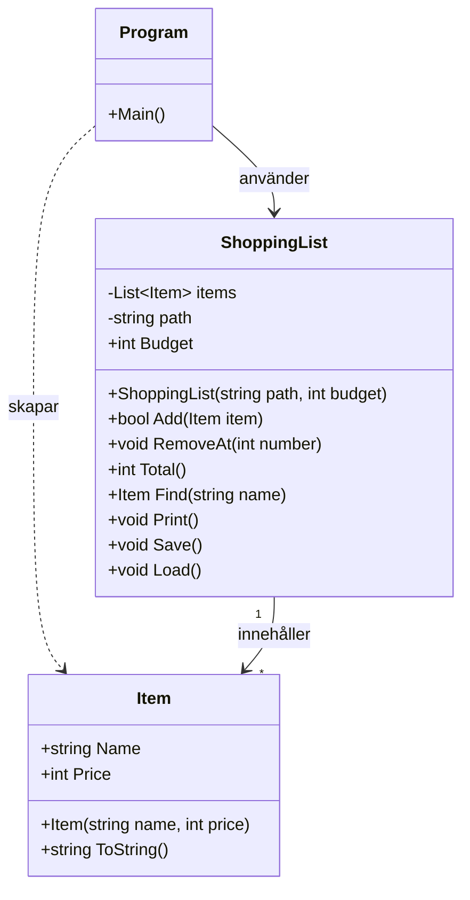

# Kunskapskontroll 2: Robust Inköpslista

## Felrapport

### Fel 1: Programmet krashade vid start.

**Vad hände:** Programmet krashade direkt med IndexOutOfRangeException rad 90. i Load(). Namn syntes inte heller i listan och sökning hittade inget.

**Varför:** Load() läste filen med ReadAllText och delade den med Split("\n"). Filen använder "\r \n" som radbrytning så \r blev kvar i slutet av varte namn. Efter sista radbrytningen blev det dessutom en tom rad alltså i items.txt rad 4, som bara gav en bit vid "Split(";"). och då fanns inget parts[1]". 

**Lösning:** Jag bytte till File.ReadAllLines som dela upp filen i rader och tar bort "\r\n". Jag lade också till if (parts.Length !=2) continue; så att tomma eller trasiga rader hoppas över.

### Fel 2: När man skrev bostäver i programmet så krashade det.

**Vad hände:** Om man skrev bostäver i menyn, i priset eller i numret krashade programmet med "FormatException"

**Varför** Koden använde "int.Parse" som kastar ett undantag om texten int eär ett tal.

**Lösning:** Jag bytte till "int.TryParse". Om det inte är ett tal får användaren och ett meddelande och kommer tillbaka till menyn med "continue"

### Fel 3: Borttagning av en vara som inte finns krashade programmet.

**Vad hände:** Om man skrev ett nummer som inte fann till exempel 7 och listan va 5, krashade programmet.

**Varför:** "RemoveAt" kontrolelrade inte att numret fanns i listan.

**Lösning:** Jag lade till if(number < 1  || number > items.Count) som visar ett meddelande och avbryter med "return". Kontrollen skydda under 1 samt över listan antal.

### Fel 4  Programmet krashade om items.txt saknades.

**Vad hände:** då jag ändrade till items2.txt så kunde den inte hitta items.txt så krashade prorammet vid start med FileNotFoundException.

**Varför**  Filen fanns inte, så "ReadAllLines" kunde inte göra sitt jobb. Den kastade då ett "FileNotFoundException", eftersom den inte hittade filen. Då ingen "catch" fångade felet kraschade programmet.

**Lösning** Jag lade ReadAllLine i en try/catch som fångar "FileNotFoundException". Programmet starta då med tom listas.

### Fel 5: Total summan blev fel.

**Vad hände:** Totalen längst ner i listan stämde inte. Den första varan pris räknads aldrig med.

**Varför:** Loopen i Total() började på i = 1 istället för i = 0. Då index listan börja alltid med 0 då blir det att första varan hoppa över om den ska börja på i = 1.

**Lösning:** Jag ändrade loopen så att den började på i = 0, och då så räknade alla varor med.

### Fel 6: Tom catch i Save(), dold fel

***Vad hände:***  Programmet krashade inte och gick att köra osm vanligt, så felet märktes inte vid normal användning. Enligt uppgiften skulle jag lägga till en Exception.

Catchen va tom, inget fel men såg på uppgiften med skulle längga någon exception

**Varför:** Save() hade en tom Catch som fångade alla fel utan att göra något med de. och listan är sparad o låg efter try/catch så de skrev ut oavsett spraningen lyckades eller inte.

**Lösning:**  Jag flyttade Listan är sparad in  i try-blocket så att det bara visas när sparningen lyckades. Jag ersatte den tomma catch med catch för `UnaunthorizedAcessException` då denna exception skydda på filen är skrivskyddad eller behörighet, då det skriver ut ett felmeddelande så att användaren får veta att sparningen misslyckades. 

# Kontrollupgift 2

### Item skydda sig själv

Konstruktorn i `Item` kontrollerar värdena innan de sparas:

- **Tomt namn:** `string.IsNullOrWhiteSpace(name)` kastar `ArgumentException`. Fångar både tom text och bara mellanslag.
- **Negativt pris:** `price < 0` kastar `ArgumentOutOfRangeException`.

Om något är fel kastas undantaget och ingen vara skapas. `Program.cs` fångar undantagen med `try`/`catch` och skriver ut `ex.Message`, så användaren får veta vad som var fel och programmet fortsätter. `Load()` fångar samma undantag, så att en trasig rad i `items.txt` hoppas över i stället för att krascha programmet vid start.

### Budget tak

`ShoppingList` har en `Budget` som sätts i konstruktorn där jag har valt 500kr `ShoppingList list = new ShoppingList("items.txt", 500);` som ligger i `Program.cs`. Innan en vara läggs till kollar `Add` om Total() + `item.Price` skulle bli större än budgeten. I såfall läggs varan inte till. 

### Designval

När en vara inte får plats i budgeten returnerar `Add` värdet `false`. Jag valde det i stället för att kasta ett undantag.

**Varför:** Att pengarna inte räcker är inget fel i programmet, det är något som händer ofta när man handlar. Undantag använder jag för saker som är fel, till exempel en vara med negativt pris. Därför kastar `Item` undantag, men `Add` svarar bara `false`.

**Vad Program.cs gör med svaret:** `Program.cs` kollar svaret från `Add` med `if`/`else`. Om svaret är `true` skrivs "Varan lades till". Om svaret är `false` skrivs "Varan får inte plats i budget".

## Designval

`Add` returnerar en `bool`. Den svarar `true` om varan får plats i budgeten och läggs till, och `false` om varan inte får plats. Jag valde att svara `false` i stället för att kasta ett undantag när budgeten spräcks.

**Varför:** Att pengarna inte räcker är inget fel i programmet, det är något som händer ofta när man handlar. Undantag använder jag för saker som är fel, till exempel en vara med negativt pris. Därför kastar `Item` undantag, men `Add` svarar bara `false`.

**Vad Program.cs gör med svaret:** `Program.cs` kollar svaret från `Add` med `if`/`else`. Om svaret är `true` skrivs "Varan lades till". Om svaret är `false` skrivs "Varan får inte plats i budget".

## Klassdiagram

